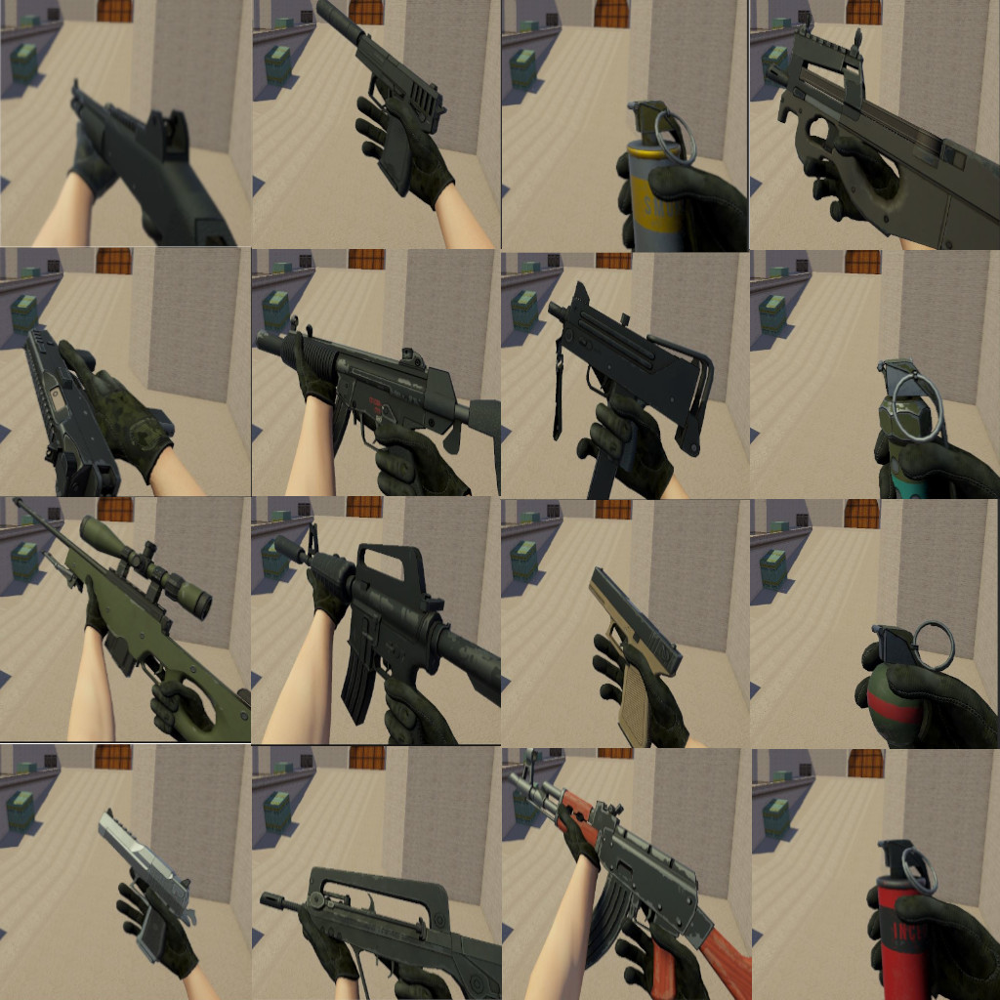
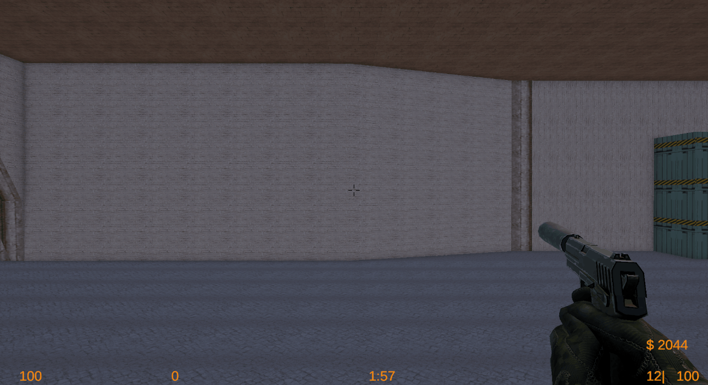
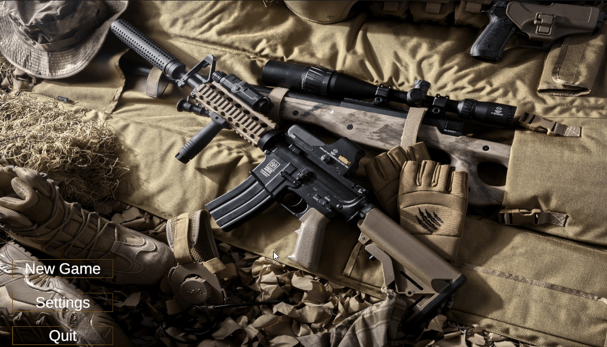

# Hostile Grounds - CS 1.6 Inspired Game
A modern recreation of classic Counter-Strike-style tactical FPS gameplay built in Unity (C#).

## Overview
Hostile Grounds is a first-person shooter project inspired by the classic video game Counter-Strike 1.6.  
The goal of the project is to preserve core gameplay mechanics such as round-based combat, team roles, and economy systems, while improving visuals, effects, and overall presentation using modern tools.

## Academic Context
Developed as a final-year dissertation project for a BSc (Hons) Computer Science degree.

## Core Gameplay Systems
- Round-based system that resets players and AI
- Economy system with round win bonus and enemy kill bonus
- Buy zone warning and start-of-round buy time
- Armor system
- Scoreboard
- Player death animation and round reset
- Basic deathmatch AI with pathfinding and death condition

## Weapons & Combat
- Bullet ejection with sound effects
- Gun smoke effects
- Body/headshot hit sounds
- Fall damage sound and body/headshot hit sound for player
- Player damage indicator
- Grenades: Smoke, Flash, HE, Fire, Decoy 
- Additional AI weapon variations (3–4 long rifles)

## Audio & Feedback
- Footstep sounds for player and AI
- Landing camera shake and fall damage
- Message display system

## UI & Menus
- Main menu (simple design with keybind and sound settings saving)
- In-game menu (quit, settings, new game)

## Gameplay showcase

- Map overview:  

  

- Weapons:  

  

- Weapon recoil:  
  

- Buy menu:  
  

- Main Menu
  

## How To Run
### Download a build 
1. Go to **Releases**
2. Download the latest build for Windows
3. Run `HostileGrounds.exe`

